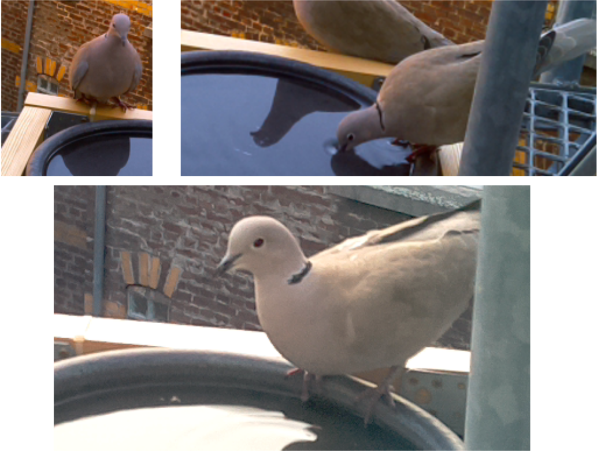
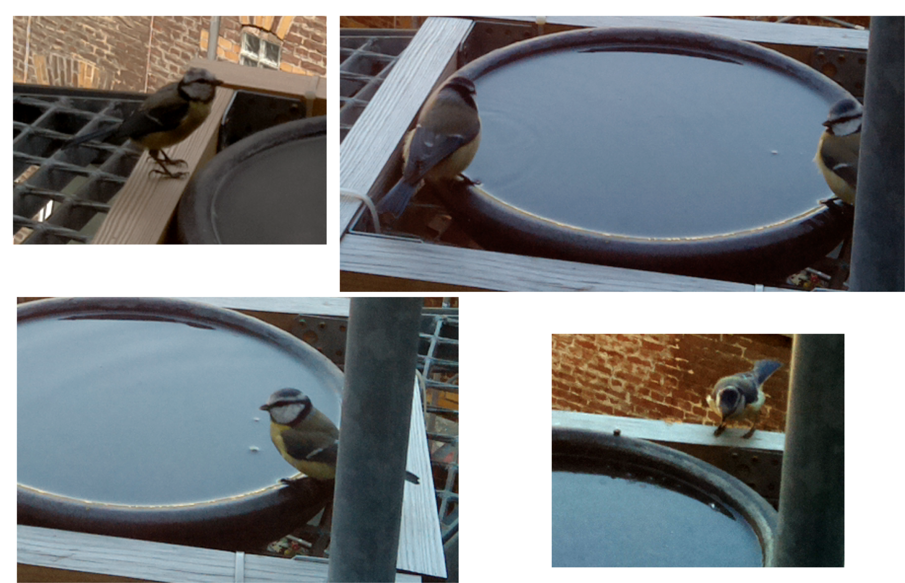

# Vogelkamera mit dem Raspberry PI

## Rebecca Breu, Juni 2015

# Wie alles begann...

... wird die überhaupt benutzt?

# Erster Versuch: Digitalkamera

* Intervallaufnahmen mit Digitalkamera
* Suchen nach "interessanten" Bildern mit Python:

    import glob
    import numpy
    from matplotlib import image

    def rgb2gray(rgb):
        return numpy.dot(rgb[...,:3], [0.299, 0.587, 0.144])

    oldimg = None

    for infile in glob.glob('*.JPG'):
        img = rgb2gray(image.imread(infile))

        if oldimg is not None:
            diff = numpy.linalg.norm(img - oldimg)
            # ... do something
        oldimg = img

# Probleme:

* Batterie der Kamera reicht nur für gut drei Stunden
* Bilder kopieren und auswerten per Hand wird nervig...

# Zweiter Versuch: Raspberry PI und Kamera-Modul

# Sonnenstandsberechnung mit astral

    from astral import Astral

    a = Astral()
    a.solar_depression = 3
    location = a['Berlin']

    location.latitude = 50.9534001
    location.longitude = 6.9548886
    location.elevation = 56

    print(location.dawn())
    print(location.dusk())

    2015-06-09 05:00:25+02:00
    2015-06-09 22:02:27+02:00

# PICamera — Python-Modul für die Kamera

    import time
    import picamera

    with picamera.PiCamera() as camera:
        camera.resolution = (1024, 768)
        camera.start_preview()
        # Camera warm-up time
        time.sleep(2)
        camera.capture('test.png')

        camera.start_recording('my_video.h264', motion_output='motion.data')
        camera.wait_recording(60)
        camera.stop_recording()

# Bewegungsdaten

* Kamerachip liefert Bewegungsdaten zur Kodierung mit H264-Codec
* Es werden 16x16-Pixel-Blöcke betrachtet
* Für jeden Block: 2D-Vektor, wohin sich der Block bewegt + Wert, wie sehr sich alter und neuer Block unterscheiden

# Bewegungsdaten on the fly analysieren

    class MotionAnalyser(picamera.array.PiMotionAnalysis):

        FRAMES = 5

        def __init__(self, *args, **kwargs):
            super(MotionAnalyser, self).__init__(*args, **kwargs)
            self.motion = None
            self.last_motions = deque([0] * self.FRAMES, maxlen=self.FRAMES)

        def analyse(self, m):
            data = numpy.sqrt(
                numpy.square(m['x'].astype(numpy.float)) +
                numpy.square(m['y'].astype(numpy.float))
            )
            norm = numpy.linalg.norm(data)
            self.last_motions.append(norm)
            if min(self.last_motions) > MOTION_THRESHOLD:
                self.motion = True

    with MotionAnalyser(camera) as analyser:
        camera.start_recording('/dev/null', format='h264', motion_output=analyser)
        while True:
            if analyser.motion:
                camera.stop_recording()
                # ...
                break
            time.sleep(0.1)

Erste Ergebnisse nach ein paar warmen, trockenen Tagen: Es kommen Vögel zum Trinken und Baden!

Aber...

# Wellen durch Wind und Regen = Bewegung :(

# Dritter Versuch: Passiver Infrarot-Sensor

# Das RPi-GPIO-Modul

    from RPi import GPIO
    import time

    IR_PIN = 14 # data

    GPIO.setmode(GPIO.BCM)
    GPIO.setwarnings(False)
    GPIO.setup(IR_PIN, GPIO.IN)

    try:
        while True:
            if GPIO.input(IR_PIN):
                print('Bewegung!')
            time.sleep(1)
    except KeyboardInterrupt:
        GPIO.cleanup()

# Das RPi-GPIO-Modul

    GPIO.add_event_detect(IR_PIN, GPIO.RISING)
    while True:
        if GPIO.event_detected(IR_PIN):
            print('Bewegung!')
        time.sleep(1)

Interrupts:

    def my_callback(channel):
        print('Bewegung!')

    GPIO.add_event_detect(IR_PIN, GPIO.RISING, callback=my_callback)

# Aber...

* Sensor nicht empfindlich genug für kleine Vögel
* Sensor reagiert träge

:(

Gibt es bessere Sensoren?

# Vierter Versuch: Bewegungsanalyse v. 2

* Idee: Ignorieren der Wasseroberfläche
* Vögel werden zumindestens beim Anflug erkannt und wenn sie auf dem Rand sitzen
* Eventuell weniger Aufnahmen von badenden Vögeln in der Mitte der Tränke
* Dafür kein Bilder-Spam bei Wind und Regen
* Annahme: Kamera immer in gleicher Position, d.h. Wasseroberfläche anhand fester Pixelbereiche identifizierbar

# Motion Mask

# Anpassen der Bewegungs-Analyse

    motion_mask = matplotlib.image.imread('motion_mask.png')[..., 0]

    class MotionAnalyser(picamera.array.PiMotionAnalysis):

        # ...

        def analyse(self, m):
            data = numpy.sqrt(
                numpy.square(m['x'].astype(numpy.float)) +
                numpy.square(m['y'].astype(numpy.float))
            )
            data = numpy.multiply(data, motion_mask)
            norm = numpy.linalg.norm(data)
            self.last_motions.append(norm)
            if min(self.last_motions) > MOTION_THRESHOLD:
                self.motion = True

# Und...

**... es funktioniert! \o/**

(Kamera-Anbringung kann optimiert werden: Fixe Position, aber Fenster muss geöffnet werden können.)

# Ergebnisse

* Vögel kommen regelmäßig zum Trinken und Baden
* Sieben Vogelarten gesichtet (darunter solche, die sich sonst nicht im Innenhof aufhalten)
* Insekten trinken ebenfalls
* ... ich muss öfter Fenster putzen

Amsel

Hausrotschwanz

Kohlmeise

Türkentaube

Elster

Blaumeise

Honigbiene

# Danke!

